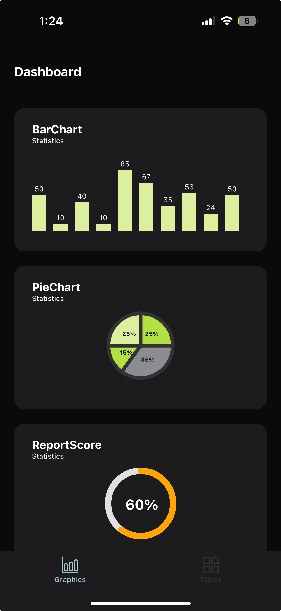

# Project Overview

This project was developed using **Expo** for rapid development and testing. The primary focus was on visualizing data through graphs on **iOS**.

## How to Run the App

To start the application, use the following command:

```sh
expo start
```

## Dependencies Used

The following dependencies were used in this project:

- `react-native-svg`
- `styled-components`
- `@react-navigation`

## Data Disclaimer

The data used in this project is **hardcoded** and does not represent real information. The main goal was to focus on graphical visualization and UI development.

## 🚀 Deployment iOS  
To test the application on iOS, follow this link:  
https://webapp.diawi.com/install/aZ42jT

## 🖼 App Preview  

